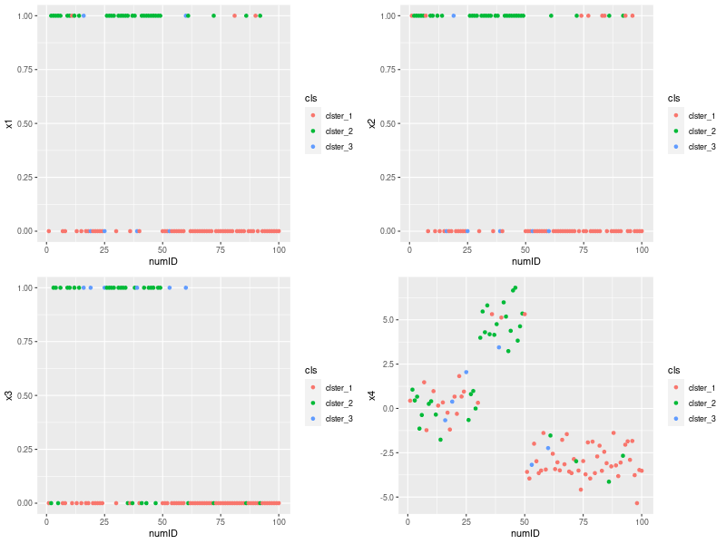
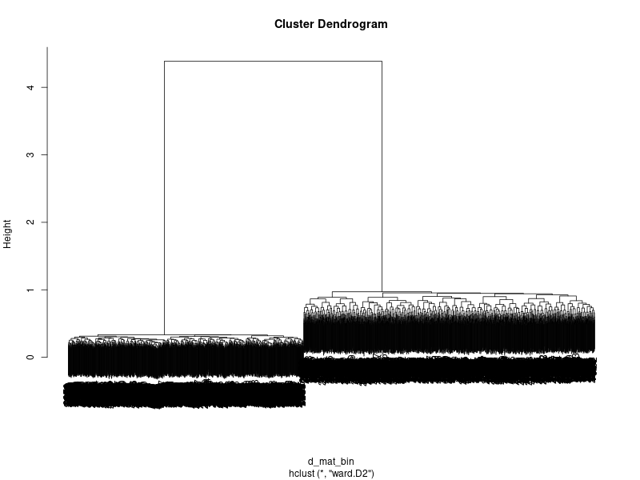
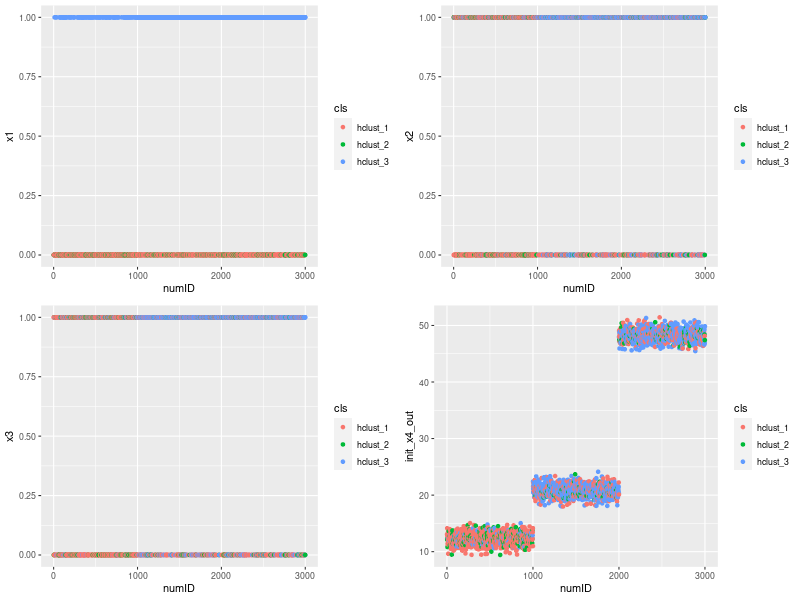

# 2値データでクラスター分析をするとヤバイ

## 準備
```r
# フォルダ構成
dir.create("./01_input")
dir.create("./02_output")
dir.create("./03_source")

# 実験データ作成
set.seed(1234)
x11 <- rbinom(30, 1, 0.5)
x12 <- rbinom(20, 1, 0.75)
x13 <- rbinom(50, 1, 0.2)

## x11, x12, x13とそれぞれ対応するように変数を作成
x21 <- ifelse(x11==1, rbinom(30, 1, 0.7), rbinom(30, 1, 0.1))
x22 <- ifelse(x12==1, rbinom(20, 1, 0.8), rbinom(20, 1, 0.05))
x23 <- ifelse(x13==1, rbinom(50, 1, 0.75), rbinom(50, 1, 0.25))

x31 <- ifelse(x11==1, rbinom(30, 1, 0.9), rbinom(30, 1, 0.1))
x32 <- ifelse(x12==1, rbinom(20, 1, 0.6), rbinom(20, 1, 0.04))
x33 <- ifelse(x13==1, rbinom(50, 1, 0.59), rbinom(50, 1, 0.01))

## 比較のため、連続値も独立に挿入
x41 <- rnorm(30, 0, 1)
x42 <- rnorm(20, 5, 1)
x43 <- rnorm(50, -3, 1)

## データとして保持
kmeans_data <- data.frame(
  id = paste0("id_", c(1:100)),
  numID = c(1:100),
  x1 = c(x11, x12, x13),
  x2 = c(x21, x22, x23),
  x3 = c(x31, x32, x33),
  x4 = c(x41, x42, x43)
)

rm(x11, x12, x13,
   x21, x22, x23,
   x31, x32, x33,
   x41, x42, x43)

## graph_function
### データの可視化を1関数で実現。
plot_this_proj <- function(){
  
  graph_1 <- ggplot(data = kmeans_data, aes(x = numID, y = x1, color = cls)) +
    geom_point()
  
  graph_2 <- ggplot(data = kmeans_data, aes(x = numID, y = x2, color = cls)) +
    geom_point()
  
  graph_3 <- ggplot(data = kmeans_data, aes(x = numID, y = x3, color = cls)) +
    geom_point()
  
  graph_4 <- ggplot(data = kmeans_data, aes(x = numID, y = x4, color = cls)) +
    geom_point()
  
  output <- gridExtra::grid.arrange(graph_1, graph_2, graph_3, graph_4)
  return(output)
}

```

- データはID昇順で3クラスタに分かれる。
  - そのため以降の結果はIDと各変数のプロット
  - 実務ではこの前提はない。
    - クラスタを付与して各変数とプロットするなどするなどがある

## k-means

### クラスタリング実行
```r
## k-means for binary data ONLY
k_means_bin <- stats::kmeans(kmeans_data[,c("x1", "x2", "x3")], centers = 3, iter.max = 20000)
kmeans_data$cls <- paste0("clster_",k_means_bin$cluster)

png("./02_output/pic1_kmeans_with_only_bin.png", width = 800, height = 600)
graph_bin <-  plot_this_proj()
dev.off()
```

### 結果



- データ作成時の想定とは異なる色分類となってしまった。
  - 重心の計算がうまくいっていない。おそらく初期値から動かない？

## 階層クラスタリング

### クラスタリング実行
```r
params <- list()
params$width <- 800
params$height <- 600

d_mat_bin <- dist(kmeans_data[,c("x1", "x2", "x3")], method = "binary")
h_cluster_bin <- hclust(d_mat_bin, method = "ward.D2")

png("./02_output/pic3-1_dendrogram_binary_data.png", width = params$width, height = params$height)
plot(h_cluster_bin)
dev.off()
kmeans_data$cls <- paste0("hclust_",cutree(h_cluster_bin, k=3))

png("./02_output/pic3-2_hclust_with_only_bin.png", width = params$width, height = params$height)
graph_bin <-  plot_this_proj()
dev.off()

```

### 結果
- デンドログラムは以下。
  - 比較的まともに分類できているように見えるが……？



- クラスタリングの妥当度合いについてはあまり良いとは言えなそう




## まとめ
- 2値データでクラスタリングをすると詰む。
  - k-means: 2値の場合、情報量が少なすぎて重心計算ができない
  - 階層クラスタリング: 謎。おそらく情報量が少ない点は共通。
    - 平均や分散が関係？
  - 十分に検証できていない部分は少なくないので、今後追加で実験する
- `x4`を含んだクラスタリングについては記述を省略
  - [ここ](./03_source)にコード
  - [ここ](./02_output)に結果があるので各自参照。
  - おわり。

