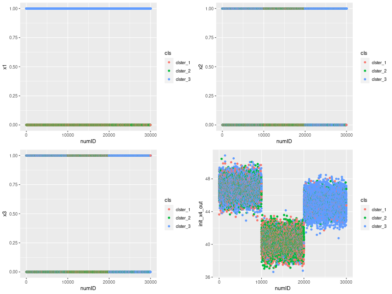

# 2値データでクラスター分析をするとヤバイ

## 準備
```r
# フォルダ構成
dir.create("./01_input")
dir.create("./02_output")
dir.create("./03_source")

# 実験データ作成
library(dplyr)
binom_cls_data_creator <- function(nrow, npat, num_cls){
 # "
 # data_create.Rの一般化。
 # クラスタ別に異なるパラメータを持つ二値変数を生成する。
 # "
  init_prob <- runif(num_cls) # 初期の生成確率。
  print(round(init_prob, digits = 2))
  init_x1   <- numeric() # x1の生成
  output    <- numeric() # 出力
  
  ## x1xとx4xを作る
  for(cls in 1:num_cls){
    init_x1_tmp <- rbinom(nrow, 1, init_prob[cls])
    init_x4_tmp <- rnorm(nrow, mean = (runif(1) * 10)^2, sd = 1)
    if(cls == 1){
      init_x1_in <- init_x1_tmp
      init_x4_in <- init_x4_tmp
      init_x1_out <- init_x1_tmp
      init_x4_out <- init_x4_tmp
    }else{
      init_x1_in <- cbind(init_x1_in, init_x1_tmp)
      init_x4_in <- cbind(init_x4_in, init_x4_tmp)
      init_x1_out <- c(init_x1_out, init_x1_tmp)
      init_x4_out <- c(init_x4_out, init_x4_tmp)
      
    }
  }
  
  ## x2x以降を作る
  for(pat in 1:npat){
    for(cls in 1:num_cls){
      ## 基本は同じだが、生成過程を変える。
      ## 各クラスタでのx1onの条件で分岐する。
      ## xx同士は独立(x1との交絡)
      init_xx_tmp <- ifelse(init_x1_in[,cls]==1,
                            rbinom(nrow, 1, runif(nrow, min = 0.8)),
                            rbinom(nrow, 1, runif(nrow, min = 0.2))
                            )
      if(cls == 1){
        init_xx_in <- init_xx_tmp
        init_xx_out <- init_xx_tmp
      }else{
        init_xx_in <- cbind(init_x1_in, init_xx_tmp)
        init_xx_out <- c(init_xx_out, init_xx_tmp)
      } 
    }

    if(pat == 1){
      output <- cbind(init_x1_out, init_xx_out)
    }else{
      output <- cbind(output, init_xx_out)
    }
  }
  colnames(output) <- paste0("x", c(1:ncol(output)))
  # colnames(init_x4_out) <- paste0("x_norm" ,c(1:ncol(init_x4)))
  output <- cbind(output, init_x4_out)
  output <- output %>%
    as.data.frame
  #   dplyr::arrange(x1)
  return(output)
}

## graph_function
### データの可視化を1関数で実現。
plot_this_proj <- function(){
  
  graph_1 <- ggplot(data = kmeans_data, aes(x = numID, y = x1, color = cls)) +
    geom_point()
  
  graph_2 <- ggplot(data = kmeans_data, aes(x = numID, y = x2, color = cls)) +
    geom_point()
  
  graph_3 <- ggplot(data = kmeans_data, aes(x = numID, y = x3, color = cls)) +
    geom_point()
  
  graph_4 <- ggplot(data = kmeans_data, aes(x = numID, y = x4, color = cls)) +
    geom_point()
  
  output <- gridExtra::grid.arrange(graph_1, graph_2, graph_3, graph_4)
  return(output)
}

```

- データはID昇順で3クラスタに分かれる。
  - そのため以降の結果はIDと各変数のプロット
  - 実務ではこの前提はない。
    - クラスタを付与して各変数とプロットするなどするなどがある

## k-means

### クラスタリング実行
```r
## k-means for binary data ONLY
kmeans_data_bin <- kmeans_data %>% 
  dplyr::select(-init_x4_out)

k_means_bin <- stats::kmeans(kmeans_data_bin, centers = 3, iter.max = 20000)
kmeans_data$cls <- paste0("clster_",k_means_bin$cluster)
kmeans_data$numID <- c(1:nrow(kmeans_data))

png("./02_output/pic1_kmeans_with_only_bin.png", width = 800, height = 600)
graph_bin <-  plot_this_proj()
dev.off()
```

### 結果



- データ作成時の想定とは異なる色分類となってしまった。
  - 重心の計算がうまくいっていない。おそらく初期値から動かない？

## 階層クラスタリング

### クラスタリング実行
```r
kmeans_data <- binom_cls_data_creator(1000, 500, 3)

params <- list()
params$width <- 800
params$height <- 600

kmeans_data_bin <- kmeans_data %>% 
  dplyr::select(-init_x4_out)
d_mat_bin <- dist(kmeans_data_bin, method = "binary")
h_cluster_bin <- hclust(d_mat_bin, method = "ward.D2")

# デンドログラム描写
png("./02_output/pic3-1_dendrogram_binary_data.png", width = params$width, height = params$height)
plot(h_cluster_bin)
dev.off()
kmeans_data$cls <- paste0("hclust_",cutree(h_cluster_bin, k=3))

# 散布図描写
png("./02_output/pic3-2_hclust_with_only_bin.png", width = params$width, height = params$height)
graph_bin <-  plot_this_proj()
dev.off()

```

### 結果
- デンドログラムは以下。
  - 比較的まともに分類できているように見えるが……？


- クラスタリングの妥当度合いについてはあまり良いとは言えなそう


## まとめ
- 2値データでクラスタリングをすると詰む。
  - k-means: 2値の場合、情報量が少なすぎて重心計算ができない
  - 階層クラスタリング: 謎。おそらく情報量が少ない点は共通。
    - 平均や分散が関係？
  - 十分に検証できていない部分は少なくないので、今後追加で実験する
- `x4`を含んだクラスタリングについては記述を省略
  - [ここ](./03_source)にコード
  - [ここ](./02_output)に結果があるので各自参照。
  - おわり。

