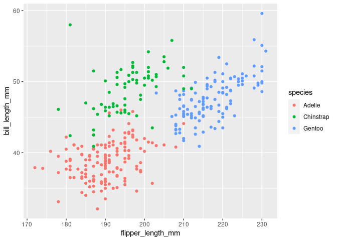

# やること

一般化線形混合モデルを使った個体別のパラメータの縮小効果について

githubは以下。

\[\]

<!-- more -->

## Rのバージョン

``` r
version
```

    ##                _                           
    ## platform       x86_64-pc-linux-gnu         
    ## arch           x86_64                      
    ## os             linux-gnu                   
    ## system         x86_64, linux-gnu           
    ## status                                     
    ## major          4                           
    ## minor          0.3                         
    ## year           2020                        
    ## month          10                          
    ## day            10                          
    ## svn rev        79318                       
    ## language       R                           
    ## version.string R version 4.0.3 (2020-10-10)
    ## nickname       Bunny-Wunnies Freak Out

## 一般化線形混合モデルって何？

以下の記事を書きました。

<!-- 過去の記事のURL -->

要は「持っているデータをグループ分けできる場合、そのグループ別に説明変数の効果が変わるんじゃない？」  
という仮説を線型回帰に反映したモデルと解釈されます。  
難しくいうと、推定されるパラメータが「個体別」の効果と「グループ別」の効果の２つに分けられる、  
という形で表現しようというモデルになります((<https://www.jstage.jst.go.jp/article/ojjams/23/2/23_2_2_139/_article/-char/ja/>))。  
個体別の効果(普通の回帰分析での回帰係数)を「固定効果」、グループ別の効果を「ランダム効果」あるいは「変量効果」と呼んだりします。  
筆者は曲がりなりにもマーケティング業界にいるつもりなので、応用先を考えると、

  - 店舗別の施策効果の違いの評価

  - 地域別の広告効果の違いの評価

  - 調査セグメントグループによる商品評価の違いの評価

など、応用先は広いなあと思っています。  
こうした目的に「グループ別に独立にパラメータを推定する」という方法もありますが、  
グループ単位でのレコード数が少ない場合、推定されたパラメータの分散がとても大きくなるという問題があります((「少地域問題」といいます。詳細:
<https://www.jstage.jst.go.jp/article/jappstat1971/35/3/35_3_139/_article/-char/ja/>))。  
こういう時に「全体の平均」方向に推定値を「縮小する」ことで、  
パラメータ推定値の分散を狭める「縮小推定」という方法があり、今回のモデルはこの方法に則っています。
一般化線形混合モデルによる推定値の縮小については[`lme4`の論文](https://cran.r-project.org/web/packages/lme4/vignettes/lmer.pdf)などにも記載されています。  
変量効果を考慮することで、固定効果は全体平均方向に縮小されて推定される、というお話(のはず)です。

Rによる実装にはいくつか方法があり、`lme4`パッケージを使う方法と、  
`stan`による階層ベイズモデルによって表現する方法があります。  
ただ、`lme4`パッケージでは回帰係数の有意性検定が計算されません。  
有意性は長く回帰係数が統計的に意味のある結果かどうかを示す指標として用いられていましたが、  
2016年に[ASAがp値に対する声明](https://www.tandfonline.com/doi/full/10.1080/00031305.2016.1154108)を出していたり、一般化線形混合モデルではパラメータ自由度の決定が難しい((<https://www.slideshare.net/masarutokuoka/ss-42957963>))ということがあったりと、各方面からの理由があります。  
とは言え有意性欲しい勢は少なくないので、`lmerTest`パッケージを使うことでp値が欲しい人たちを救済できます。  
階層ベイズモデルについてはまた別で記事を書きます。多分。

## 実装

### データ

[`penguins`](https://allisonhorst.github.io/palmerpenguins/)データを採用します。  
広く知られている`iris`はいくつか問題があり((データが散逸して、Fisherが提示したデータじゃなくなっているらしい。))、再現性という意味では望ましくないので、みんなもペンギンを分析しよう。

Rでは`palmerpenguins`パッケージでインストール可能です。

``` r
library(tidyverse)
library(palmerpenguins)

summary(penguins)
```

    ##       species          island    bill_length_mm  bill_depth_mm  
    ##  Adelie   :152   Biscoe   :168   Min.   :32.10   Min.   :13.10  
    ##  Chinstrap: 68   Dream    :124   1st Qu.:39.23   1st Qu.:15.60  
    ##  Gentoo   :124   Torgersen: 52   Median :44.45   Median :17.30  
    ##                                  Mean   :43.92   Mean   :17.15  
    ##                                  3rd Qu.:48.50   3rd Qu.:18.70  
    ##                                  Max.   :59.60   Max.   :21.50  
    ##                                  NA's   :2       NA's   :2      
    ##  flipper_length_mm  body_mass_g       sex           year     
    ##  Min.   :172.0     Min.   :2700   female:165   Min.   :2007  
    ##  1st Qu.:190.0     1st Qu.:3550   male  :168   1st Qu.:2007  
    ##  Median :197.0     Median :4050   NA's  : 11   Median :2008  
    ##  Mean   :200.9     Mean   :4202                Mean   :2008  
    ##  3rd Qu.:213.0     3rd Qu.:4750                3rd Qu.:2009  
    ##  Max.   :231.0     Max.   :6300                Max.   :2009  
    ##  NA's   :2         NA's   :2

データの中には数値型と因子型がしっかり入っており、多変量解析に広く使えるデータセットになっています。

### モデル

今回は単回帰モデルを考えます。  
具体的には「くちばしの長さ(`bill_length_mm`)」を「翼の長さ(`flipper_length_mm`)」で回帰します。  
この際、「種類(`species`)によってくちばしの長さの平均が違うんじゃね？」ということを考えます。  
`penguins`データでは、アデリーペンギン(`Adelie`)、ジェンツーペンギン(`Gentoo`)、ヒゲペンギン(`Chinstrap`)という3種類のペンギンの情報が入っているので、  
これ別になんか違うんじゃあないかという仮説を考えます。

``` r
g <- ggplot2::ggplot(usedata, aes(x = flipper_length_mm, y = bill_length_mm))+
     # scatter plot
     geom_point(aes(group = species, color = species))
plot(g)
```

<!-- -->

散布図を見る限り、この仮説はまあまあ妥当性がありそうです。

### `lme4`もとい`lmerTest`の実装

`lme4`系のモデルでは、通常Rで使う`formula`形式、つまり`y ~ x + z`的な記述の応用で変量効果を表現できます。  
今回は「種類によってくちばしの長さの平均と、翼の長さで説明できる度合いが異なる」という仮説を検証するべく、 以下のように記述しました。

``` r
glmm_model <- lmerTest::lmer(
  bill_length_mm ~ flipper_length_mm + (1 + flipper_length_mm|species),                       
  data = usedata
  )
```

結果を見ます。

``` r
summary(glmm_model)
```

    ## Linear mixed model fit by REML. t-tests use Satterthwaite's method [
    ## lmerModLmerTest]
    ## Formula: bill_length_mm ~ flipper_length_mm + (1 + flipper_length_mm |  
    ##     species)
    ##    Data: usedata
    ## 
    ## REML criterion at convergence: 1596.2
    ## 
    ## Scaled residuals: 
    ##     Min      1Q  Median      3Q     Max 
    ## -2.6469 -0.6595  0.0297  0.6924  4.9957 
    ## 
    ## Random effects:
    ##  Groups   Name              Variance  Std.Dev. Corr 
    ##  species  (Intercept)       2.6567656 1.62996       
    ##           flipper_length_mm 0.0009521 0.03086  -1.00
    ##  Residual                   6.7064017 2.58967       
    ## Number of obs: 333, groups:  species, 3
    ## 
    ## Fixed effects:
    ##                   Estimate Std. Error       df t value Pr(>|t|)   
    ## (Intercept)        1.25267    4.34480 21.25728   0.288  0.77590   
    ## flipper_length_mm  0.21789    0.02767  3.06788   7.873  0.00394 **
    ## ---
    ## Signif. codes:  0 '***' 0.001 '**' 0.01 '*' 0.05 '.' 0.1 ' ' 1
    ## 
    ## Correlation of Fixed Effects:
    ##             (Intr)
    ## flppr_lngt_ -0.886
    ## convergence code: 0
    ## unable to evaluate scaled gradient
    ## Model failed to converge: degenerate  Hessian with 1 negative eigenvalues

`Fixed
effects`の項が固定効果の結果になります。`lmerTest`のおかげで、一応「翼の長さ」の効果はないとはいえない((帰無仮説が「翼の長さの回帰係数が0である」ことに対する検定なので、これくらいの主張しかできません。本来は。「回帰係数に意味がある」というところについては、古典的なところから議論があります。))

`Random effects`の項が「種類別にどれだけばらつきがあるか」の変量効果(の分散)になります。  
ここを見ると、切片(≒平均的なくちばしの長さの違い)は種類別に異なると言えそうですが、  
翼の長さで説明できる度合いには種類別には大差がなさそうです。  
ちなみに、変量効果のパラメータ推定値は`ranef()`で出力できます。  
ただ、この`ranef()`で出力されるパラメータ推定値の分散は、`summary`で出力された分散と異なることが分かっています。  
修正の方法は`arm`パッケージの`se.ranef()`関数で各変量効果の標準誤差を計算して、  
その誤差を分散に加えることで可能です((<http://bayesmax.sblo.jp/category/4506132-1.html>))。

### 可視化

結果の可視化をしてみます。  
比較として、種類別に独立で回帰分析を実施した結果も合わせて記述します。

``` r
usedata$y_pred_glmm <- fitted(glmm_model)

g <- ggplot2::ggplot(usedata, aes(x = flipper_length_mm, y = bill_length_mm))+
     # scatter plot
     geom_point(aes(group = species, color = species)) + 
     # single linear regression model for each species.
     geom_smooth(aes(group = species, color = species),
                 method = "lm", se = F, linetype= "dashed") + 
     # fitted value from GLMM model.
     geom_smooth(aes(y = y_pred_glmm, color = species)) 
```

`ggplot2`では`geom_smooth()`で指定することで種類別に回帰直線を引くことができます。  
`method`に`"gam"`を指定すると一般化加法的モデルによるノンパラメトリックな曲線回帰もできます。  
関係性の要約はもうこれだけで困りませんね。  
結果はこう。破線が種類別の回帰、実線が一般化線形混合モデルでの結果です。

``` r
plot(g)
```

<!-- -->

特にジェンツーペンギン(青いプロット)で顕著ですが、破線部分を見ると右上の外れ値部分に  
回帰直線が「引っ張られている」ように見えることが分かります。  
一方実線部分では、その外れ値に引っ張られずに、回帰係数で表現される「傾き」が緩くなっていることが分かります。  
そしてその傾き度合いは、種類別に大きく変わらないことは、視覚的にもわかるかと思います。

## おわりに

github行けばわかるとおり`stan`で階層ベイズモデル構築済みだったりします。  
しかし数値的になんか変なので((本当なら一般化線形混合モデルの結果とかなり近似するはずなのにしない))、どこが変なのか探しながら再投稿します。ごめーんね。
